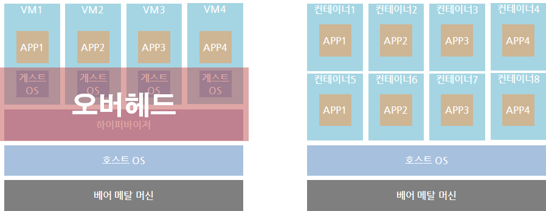
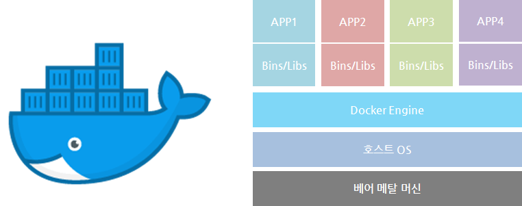
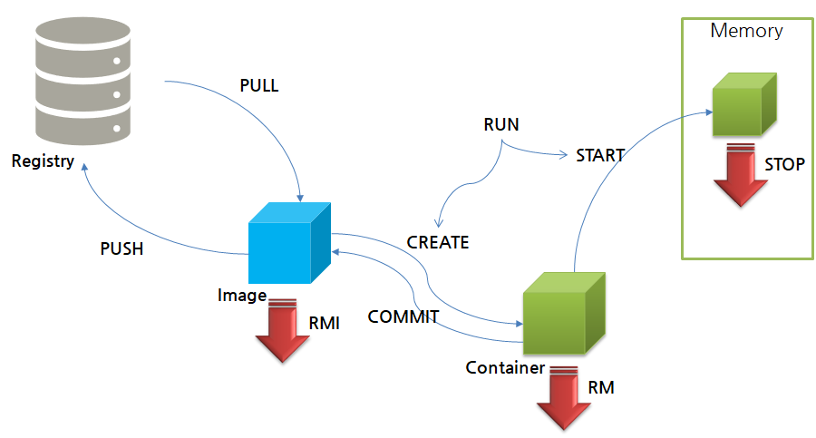
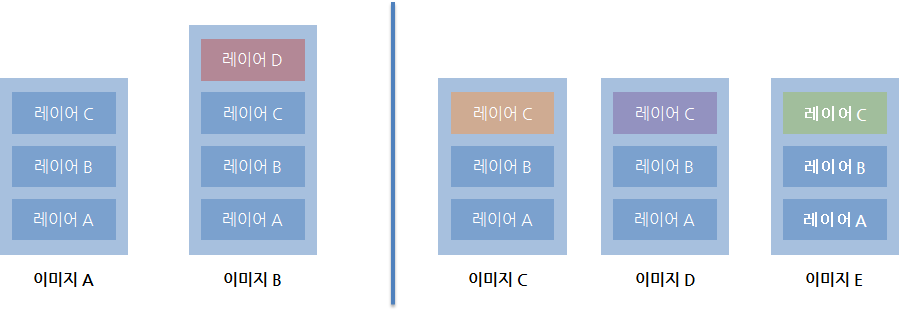

# Docker

- [Azure Container Learn](https://docs.microsoft.com/ko-kr/learn/paths/administer-containers-in-azure/)

- [Docker Docs](https://docs.docker.com/)

- [Docker 기본 명령어 정리](https://subicura.com/2017/01/19/docker-guide-for-beginners-2.html#%EB%8F%84%EC%BB%A4-%EC%84%A4%EC%B9%98%ED%95%98%EA%B8%B0)

- [Docker 입문 튜토리얼](https://www.notion.so/b67ed727aea4467cbc3226bb0c8e8336)

<br>

---

<br>

## Container 기술



> 출처 : 재즐 포프 notion

- 동일 시스템에서 실행하는 소프트웨어의 컴포넌트가 충돌하거나 다양한 종속성을 가지고 있음

- 컨테이너는 가상머신을 사용해 각 마이크로 서비스를 격리(isolate)하는 기술

- 컨테이너는 가상머신처럼 하드웨어를 전부 구현하지 않기 때문에 매우 빠른 실행 가능

- 프로세스의 문제가 발생할 경우 컨테이너 전체를 조정해야 하기 때문에 컨테이너에 하나의 프로세스를 실행하도록 하는 것이 좋다. (like 브라우저)

- 하이퍼바이저의 필요 없는 공간을 활용하면 더 많은 자원을 앱에 투자 가능

- 컨테이너 격리 기술
  - 리눅스 네임 스페이스: 각 프로세스가 파일 시스템 마운트, 네트워크, 유저(uid), 호스트 네임(uts) 등 에 대해 시스템에 독립 뷰를 제공
  - 리눅스 컨트롤 그룹: 프로세스로 소비할 수 있는 리소스 양(CPU, 메모리, I/O, 네트워크 대역대,device 노드 등)을 제한

<br>

---

<br>

## Docker 개요



> 출처 : 재즐 포프 notion

<br>

- Docker 컨테이너는 **하나의 Forefround 프로세스**를 구동하는 것이 원칙이다.
- Docker는 리눅스의 chroot 기반의 기술이다
- 컨테이너 기술을지원하는 다양한 프로젝트 중에 하나
- 다양한 운영체제에서 사용 가능(리눅스, 윈도우, MacOS)
- 애플리케이션에 국한 되지 않고 의존성 및 파일 시스템까지 패키징하여 빌드, 배포, 실행을 단순
- 리눅스의 네임 스페이스와 cgroups와 같은 커널 기능을 사용하여 가상화
- 도커는 다양한 클라우드 서비스 모델과 같이 사용 가능

<br>

---

<br>

## Docker 구성 요소

- **이미지**

  - 필요한 프로그램과 라이브러리, 소스를 설치한 뒤 만든 하나의 파일

- **컨테이너**

  - 이미지를 격리하여 독립된 공간에서 실행한 가상 환경

- **레지스트리**
  - Docker Registry는 Docker Image 저장소를 의미한다.
  - 공식 저장소로서 Docker Hub (Docker계의 Github)가 있다.
  - 이 외에도 각 클라우드 벤더에서 저장소를 지원
    - Azure Container Registry
    - AWS Elastic Container Registry
    - Google Container Registry

<br>

---

<br>

## Docker 설치

### Ubuntu

#### Install using the convenience script

```shell
curl -fsSL https://get.docker.com/ | sudo sh

docker version # 잘 설치 되었나 확인

# 기본적으로 root 계정 외에는 docker 실행 권한이 없다.
# 로그인 한 계정에 도커 그룹에 사용자를 추가하면 일반 유저도 docker 명령어 사용이 가능해 진다.
sudo usermod -a -G docker $USER

# 도커 서비스를 재기동 해준다.
sudo service docker restart

# 로그아웃 후 로그인해서 정상 동작하는 지 확인한다.
docker version

# sudo systemctl enable docker
# sudo systemctl start docker
```

### Mac OS

그냥 다운받으면 된다.

<br>

---

<br>

## Docker 기본 명령어 정리



> 출처 : 재즐 포프 notion

- `$ docker version` : 클라이언트와 서버의 버전을 알 수 있다.

<br>

- `$ docker run 이미지이름` : 이미지가 없다면 해당 이미지를 받아서 해당 이미지 기반의 Container를 Create하고 Start한다.

  - `$ docker run --name 컨테이너이름 이미지이름`
  - `$ docker run --rm 이미지이름` : 컨테이너를 생성하고 실행이 끝나면 바로 지운다.

<br>

- `$ docker container ls` : 실행중인 컨테이너 목록들을 확인할 수 있다.

  - `$ docker ps`와 같다.
  - `$ docker container ls -a` : 모든 컨테이너 목록들을 확인할 수 있다.
    - `$ docker ps -a`와 같다.

<br>

- `$ docker stop 컨테이너_ID(또는 컨테이너_이름)` : 컨테이너 실행을 중지한다.

<br>

- `$ docker container rm 컨테이너_ID` : 컨테이너를 제거한다.
  - `$ docker rm 컨테이너_ID`와 같다.

<br>

- `$ docker images` : 현재 Image 목록을 확인할 수 있다.

<br>

- `$ docker pull nginx` : nginx Image를 받아온다.

<br>

- `$ docker create 컨테이너_ID` : 해당하는 컨테이너를 실행한다.

<br>

- `$ docker start 컨테이너_ID` : 해당하는 컨테이너를 실행한다.

<br>

- `$ docker restart 컨테이너_ID` : 해당하는 컨테이너를 재실행한다.

<br>

### 유용한 명령어

- `$ docker run --rm --detach --publish 8000:80 --name nx nginx`

  - `--detach` : 백그라운드에서 실행한다. (`-d`)
  - `--public` : 포트 바인딩을 한다. `내부에서 개방할 포트 : 외부에서 접근할 포트` (`-p`)
  - `--name` : 옵션으로 컨테이너 이름을 지정할 수 있다. (`-n`)

<br>

- 컨테이너 내부 쉘 실행

```shell
docker exec -it nx /bin/bash
```

<br>

- 컨테이너 로그 확인

```shell
docker logs nx
```

<br>

- 호스트 및 컨테이너 간 파일 복사

```shell
sudo docker cp <path> <to container>:<path>
sudo docker cp <from container>:<path> <path>
sudo docker cp <from container>:<path> <to container>:<path>
```

<br>

- 호스트 및 컨테이너 간 파일 복사

```shell
sudo docker cp <path> <to container>:<path>
sudo docker cp <from container>:<path> <path>
sudo docker cp <from container>:<path> <to container>:<path>
```

<br>

- 도커 컨테이너 모두 삭제

```shell
sudo docker stop `sudo docker ps -a -q`
sudo docker rm `sudo docker ps -a -q`
```

<br>

---

<br>

## Docker Image Layer



> 출처 : 재즐 포프 notion

- 왼쪽

  - 각각 다른 이미지 A와 이미지 B에 대해 같은 레이어 A, B, C를 공유하고 있는 상태이다.

  - 이미지 A를 통해서 이미지 B를 만들면 레이어 D가 하나 생성이 되고 push를 할 때 레이어 D만 push가 된다.

  - 이미지 A가 있었을 때 이미지 B를 다운로드 받는다면 없는 레이어 D만 다운로드 받는다.

  - 이미지 A와 이미지 B를 동시에 사용하고 있는데 이미지 A를 지운다해도 레이어 A, B, C는 그대로 남아있는다.

- 오른쪽
  - 레이어 A, B는 동일하게 각각의 이미지에서 사용하고 있고 레이어 C는 다르게 올려놓은 것이다.
  - 이미 존재하는 레이어 A, B는 새로 다운로드 받을 필요가 없음

### Docker 이미지 정보 확인

```shell
docker pull nginx
docker inspect nginx
```

### Docker 이미지 저장소 확인

```shell
# Docker 이미지 저장소 위치 확인
docker info
cd /var/lib/docker/overlay2

# 레이어 저장소 확인
ls
```

### Docker 용량 확인하기

```shell
#도커가 설치된 환경 용량 확인
du -sh /var/lib/docker/
2.0G	/var/lib/docker/

# 도커 이미지에 대한 정보 저장 디렉토리
du -sh /var/lib/docker/image/
2.7M	/var/lib/docker/image/

# 도커 이미지의 파일 시스템이 사용되는 실제 디렉토리
du -sh /var/lib/docker/overlay2/
2.0G	/var/lib/docker/overlay2/

# 도커 컨테이너 정보 저장 디렉토리
du -sh /var/lib/docker/containers/
136K	/var/lib/docker/containers/
```

<br>

---

<br>

## Docker Playground

- `$ docker run --rm -it python:3.9` : python 3.9 버전 사용하기

  - `-it` : 표준 입출력이 가능하게 된다.

<br>

- `$ docker run --detach --publish 8080:80 --name mynginx nginx` : nginx 웹 서버 띄우기

  - nginx 이미지를 통해 mynginx Container 적재 및 실행
  - nginx 이미지는 80포트로 listen으로 세팅되어 있다.
  - host의 8080포트와 container의 80포트를 연결
  - `http://localhost:8080` 주소로 접속 가능
  - `$ docker stop mynginx` : mynginx container 정지
  - `$ docker rm mynginx` : mynginx container 삭제

<br>

- `$ docker run -d -p 8080:80 --volume 'pwd'/html:/usr/share/nginx/html --name mynaginx nginx` : (MAC/Linux) 현재 디렉터리내 html/index.html을 서버에 올린다.

<br>

---

<br>

## Docker로 프로젝트 폴더를 docker hub에 올리기

[Docker Hub 링크](https://hub.docker.com)

**Dockerfile은 Docker 이미지를 만들 때, 수행할 명령과 설정들을 시간 순으로 기술한 파일이다.**

아래와 같은 디렉터리 구조가 있다고 하자.

- `my_test_project`
  - `backend`
  - `requirements.txt`
  - `Dockerfile`

backend는 Django기반의 앱이고 Dockerfile은 아래와 같이 쓰였다.

```Dockerfile
### docker biuld
# ubunto의 18년도 4월 버전 OS를 사용한다.
FROM ubunto:18.04

# 빌드시에 수행할 명령
RUN apt-get update && \
    apt-get install -y python3-pip python3-dev && \
    apt-get clean

# code 이름의 work directory를 지정한다. 만약 폴더가 없다면 자동 생성한다.
WORKDIR /code/

# ./backend/requirements.txt 파일을 code에 복사한다.
ADD ./backend/requirements.txt /code/

# 프로젝트 패키지를 설치한다.
RUN pip3 install -r requirements.txt

# ./backend 폴더를 code에 복사한다.
ADD ./backend /code/

### docker run
# 컨테이너에서 구동할 때 8000번 포트에서 구동할 것이다.
EXPOSE 8000

# 서버를 띄운다. (실서비스에서는 gunicorn이나 uwsgi를 사용한다.)
CMD ["python3", "/code/manage.py", "runserver", "0.0.0.0:8000"]
```

<br>

1. `$ docker build -t test_dj .`

   - 현재 디렉터리를 test_dj라는 이미지로 빌드한다.
   - `-t` : `--tag`와 같다. 이미지 이름을 설정한다.
   - `.` : 현재 디렉터리를 의미한다.

   - 빌드한 후 `$ docker run --rm -p 9000:8000 test_dj` 으로 로컬서버를 열 수 있다.
     - `-p` : `--publish`를 의미한다.

<br>

2. `$ docker tag test_dj amamov/test_dj_2020`
   - docker hub에 올리기 위해 이미지를 태그한다. 애초에 빌드할 때 `$ docker build -t amamov/test_dj .`해도 된다.
   - `$ docker tag <옵션> <이미지 이름>:<태그> <저장소 주소, 사용자명>/<이미지 이름>:<태그>`
   - `$ docker tag test_dj amamov/test_dj_2020:0.1`으로 0.1 태그를 붙일 수 있다. 여기서 0.1태그는 버전정보를 의미한다.

<br>

3. `$ docker login`

<br>

4. `$ docker push amamov/test_dj_2020`
   - docker hub에 올린다.

<br>

### 히스토리 확인하기

```bash
docker history amamov/test_dj_2020
```

<br>

---

<br>

## Docker private registry 만들기

### private registry 만들기

```bash
docker run -d --name docker-registry -p 5000:5000 registry
```

### private registry에 이미지 push하기

```bash
sudo docker tag echo_test 127.0.0.1:5000/echo_test
sudo docker push 127.0.0.1:5000/echo_test
```

<br>

---

<br>

## Docker Hub에 업로드한 Image를 실제 웹 서버(클라우드)에서 사용하기

[AWS - lightsell](https://lightsail.aws.amazon.com/ls/webapp/create/instance?region=ap-northeast-2)에서 VM(Virtual Machine)을 사용할 수 있다. (EC2에 비해 확장성이 떨어지지만 저렴하게 사용할 수 있다.)

"AWS - lightsell"에서 Ubunto 가상환경을 선택하고 인스턴스를 생성한 후, 콘솔을 실행한다.

1. `$ sudo apt-get update`

   - 기본적으로 우분투가 내부적으로 설치할 패키지 목록을 OS가 가지고 있는데 이 목록을 업데이트한다.

<br>

2. `$ sudo apt-get install docker.io`

   - Docker를 설치한다.

<br>

3. `$ docker version`

   - docker 버전을 알 수 있다.

<br>

4. `$ sudo docker run --rm hello-world`

   - "hello-world" 이미지를 받아서 실행한다.(테스트)

<br>

5. `$ sudo docker run --rm --publish 80:8000 amamov/test_dj_2020:0.1`
   - docker-hub에 있는 test_dj_2020 이미지를 받아서 실행한다.
   - 이는 콘솔을 닫으면 서버도 꺼진다. 이러한 단점을 보완하기 위해 "docker swarm"을 사용한다.
   - "docker swarm"이란 도커가 공식적으로 만든 오케스트레이션 툴이다. 오케스트레이션 툴이란 여러 호스트 서버의 컨테이너들을 배포 및 관리를 위한 툴이다. ["docker swarm 링크"](https://docs.docker.com/engine/swarm/)

<br>

6. `$ sudo docker swarm init`

   - docker swarm을 초기화한다.
   - VM이 3대가 있다고 했을 때 그중에 한 대가 매인이 되어야한다. 매인 VM에서 init을 수행한다. 나머지 두 대의 VM에서는 매인 VM에 속하게 하기 위해 `$ docker swarm join`명령을 사용한다.

<br>

7. `$ sudo docker node ls`

   - 클러스터가 여러 개이면 묶여 있는 다른 여러 머신들이 보인다.

<br>

8. `$ sudo docker service create --replicas 1 --name test_dj --publish 80:8000 amamov/test_dj_2020:0.1`

   - 컨테이너를 docker swarm이 관리하게 된다.
   - `--replicas` : 컨테이너를 몇개 만들어서 분산할 것인가
   - `test_dj` : 서비스 이름

<br>

9. `$ sudo docker service ls`

   - 서버가 열린 것을 확인할 수 있다.

<br>

10. `$ sudo docker service update --image amamov/test_dj_2020:0.2 test_dj(서비스이름)`

    - "docker service update"로 업데이트한 소프트웨어를 재배포할 수 있다. 입력한 명령어는 0.1에서 0.2로 업데이트를 한 것이다. 반대로 0.2에서 0.1로 롤백도 할 수 있다.
